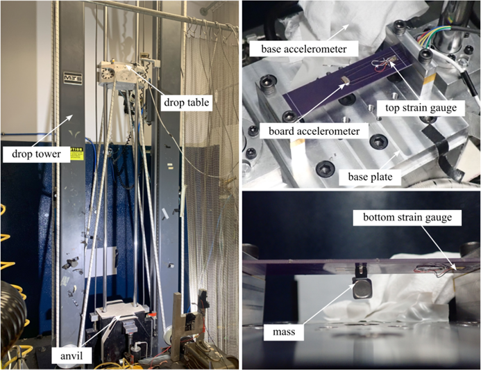
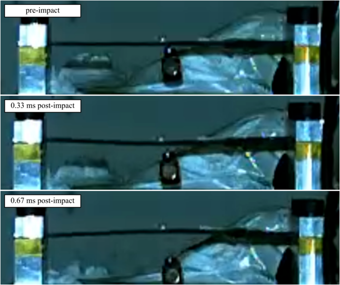
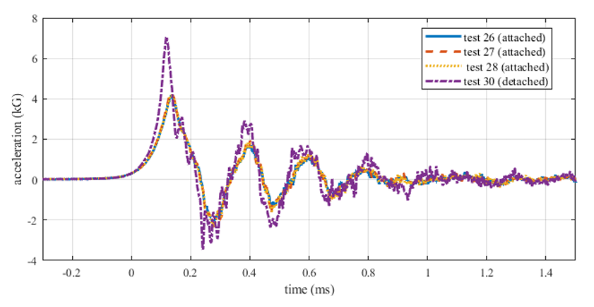

# Dataset-9 Repeated Impact Testing of Rectangular Electronic Assembly
Dataset 9 repeated impact testing of a rectangular electronic assembly with the intention of controlled and monitored failure of an electronic component.

L5B03 is a 5.5-inch board configured in a fixed-fixed supported test structure (effective length 4.5 in).

A 2 Watt 1 kOhm resistor was used for this experiment. (https://www.digikey.com/en/products/detail/te-connectivity-passive-product/SMQF21K0JT/21316632?s=N4IgTCBcDaIMoFkCKAxMBGA0gBgFIBUQBdAXyA)

**Figure 1:** Drop tower test setup including the top and bottom of the fixed-fixed PCB.

**Figure 2:** Frames from a high-speed camera showing the board during a resistor failure drop.

**Figure 3:** Time series representation of shock tests leading up to a final test where the resistor became detached.

## Licensing and Citation

This work is licensed under a Creative Commons Attribution-ShareAlike 4.0 International License [cc-by-sa 4.0].

Cite this data as: 

Yount, Ryan, Jacob Dodson, and Adriane Moura. Dataset-9 Repeated Impact Testing of Rectangular Electronic Assembly. High-Rate-SHM-Working-Group. Accessed at "Dataset 9 Repeated Impact Testing of Rectangular Electronic Assembly."

#### Bibtex

@Misc{YountDataset9Repeated,  
  author = {Ryan Yount and Jacob Dodson and Adriane Moura},  
  title  = {Dataset-9 Repeated Impact Testing of Rectangular Electronic Assembly},  
  groups = {High-Rate-SHM-Working-Group},  
  url    = {Dataset 9 Repeated Impact Testing of Rectangular Electronic Assembly},  
}  
